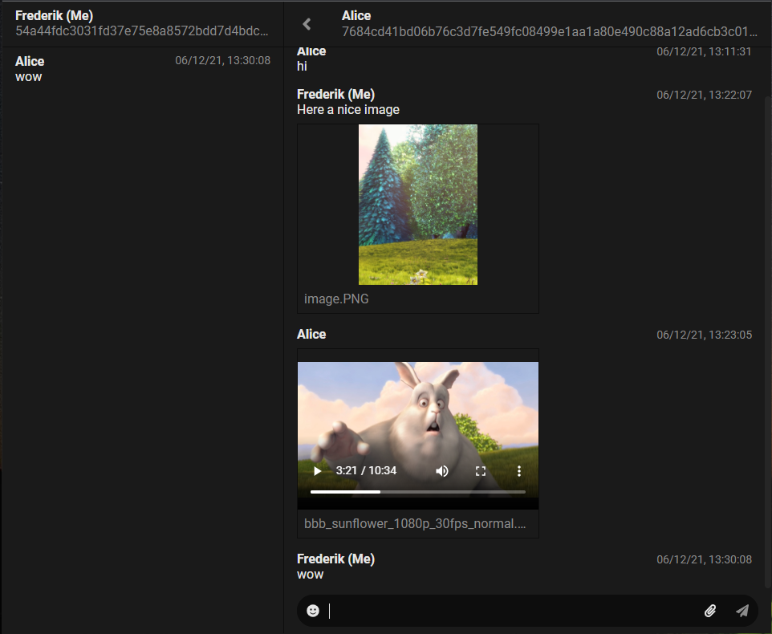

# P2P Chat application

This is a showcase application for what can be done using p2p technologies.

No bug fix or new features will be added.

To support the next iteration of the project star this github repo.

- download for [Windows](https://github.com/freddi301/memita-p2p-prototype-1/releases/download/release/p2p-apps-chat-desktop-0.0.0.Setup.exe)

# Develop

- `yarn`
- `USER_FOLDER=user-data/frederik PORT=8080 yarn dev`
- `USER_FOLDER=user-data/alice PORT=8090 yarn dev`

# Build binaries
- `yarn distribute`

## Requisites

- [nodejs](https://nodejs.org/en/)
- [yarn](https://yarnpkg.com/)